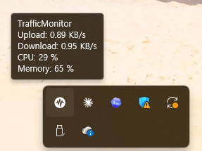
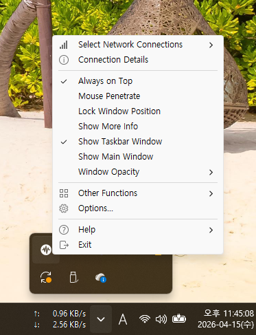
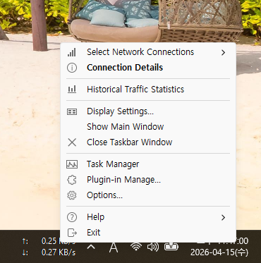
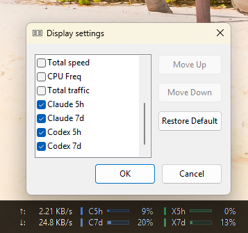

# ClaudeUsagePlugin


See Claude and Codex usage directly in the Windows taskbar through TrafficMonitor.
This repo ships a single `ClaudeUsagePlugin.dll`, with Claude values supplied by a dedicated Claude web helper and Codex values read from local Codex state.

Versioning and release notes are tracked in [CHANGELOG.md](CHANGELOG.md).

<p align="center">
  
</p>

## Highlights

- Shows `C5h`, `C7d`, `X5h`, and `X7d` directly in TrafficMonitor
- Ships as a single DLL for official TrafficMonitor installs
- Uses a single Claude web-helper source plus a short fresh-snapshot window
- Reads Codex usage from local Windows-readable state with `CODEX_HOME` support
- Displays reset timing in tooltips when the upstream source exposes it

## About TrafficMonitor

[TrafficMonitor](https://github.com/zhongyang219/TrafficMonitor) is a Windows system monitor that can show network speed, CPU, and memory in a floating window or directly in the taskbar.
`ClaudeUsagePlugin.dll` extends that taskbar window through TrafficMonitor's plug-in system, so this repository ships only the plug-in DLL and expects an official TrafficMonitor installation.

If you do not need TrafficMonitor's temperature monitoring features, the official Lite release is usually enough for this plug-in workflow.

## Getting Started

1. Install the official TrafficMonitor release and choose the same architecture as the plugin DLL you plan to use.
2. Copy `ClaudeUsagePlugin.dll` into the TrafficMonitor `plugins` directory, then restart TrafficMonitor.
3. Open TrafficMonitor's taskbar window and enable `Claude 5h`, `Claude 7d`, `Codex 5h`, and `Codex 7d`.
4. If you want Claude values to track the Claude web dashboard more closely, run the one-time Claude login:

```powershell
powershell -ExecutionPolicy Bypass -File .\scripts\claude-web-helper.ps1 login
```

5. If your Codex data does not live in `%USERPROFILE%\.codex`, set `CODEX_HOME` in the Windows environment before launching TrafficMonitor.

After setup, the taskbar should show `C5h`, `C7d`, `X5h`, and `X7d`, and the tooltip should show reset timing when that source exposes it. If the bundled helper files stay next to the DLL, TrafficMonitor will auto-start the Claude watcher on plugin load after that first login.

## Enable the TrafficMonitor taskbar items

1. Start TrafficMonitor. You should see its floating monitor window and its tray icon.

<p align="center">
  
</p>

2. Right-click the TrafficMonitor tray icon or floating window, then choose `Show Taskbar Window`.

<p align="center">
  
</p>

3. A TrafficMonitor taskbar widget will appear. Right-click that taskbar widget, then choose `Display Settings...`.

<p align="center">
  
</p>

4. In `Display settings`, check `Claude 5h`, `Claude 7d`, `Codex 5h`, and `Codex 7d`, then click `OK`.

<p align="center">
  
</p>

5. The taskbar widget should now show `C5h`, `C7d`, `X5h`, and `X7d`.

<p align="center">
  
</p>

## Scope

- Claude and Codex account usage
- Claude uses the Claude web helper snapshot as its only live source; if that snapshot is missing or stale, Claude shows unavailable

## Runtime compatibility

- Windows TrafficMonitor plugin DLL only
- TrafficMonitor plugin API v7
- Use the plugin DLL that matches the installed TrafficMonitor architecture:
  - `x64` plugin for `x64` TrafficMonitor
  - `x86` plugin for `x86` TrafficMonitor
- Official release assets are currently provided for `x64` and `x86`
- TrafficMonitor itself is not bundled by this repo

## What the plugin shows

- Prefix legend:
  - `C` = Claude
  - `X` = Codex
- Window legend:
  - `5h` = current 5-hour usage window
  - `7d` = current 7-day usage window
- `C5h`: current Claude 5-hour usage percentage
- `C7d`: current Claude 7-day usage percentage
- `X5h`: current Codex 5-hour usage percentage
- `X7d`: current Codex 7-day usage percentage

Tooltip text also shows reset timing when the upstream data exposes it.

## How it works

Claude usage:

- Reads a fresh Claude helper snapshot from `%LOCALAPPDATA%\trafficmonitor-claude-usage-plugin\claude-web-usage.json`
- The helper signs in through its own local Edge/Chrome profile, reads the saved Claude cookies from that profile, and calls `https://claude.ai/api/organizations/{lastActiveOrg}/usage`
- If the helper snapshot is missing or older than 90 seconds, Claude shows unavailable instead of falling back to weaker sources

Codex usage:

- Reads local Codex usage data from `%USERPROFILE%\.codex\logs_2.sqlite`
- Falls back to `%USERPROFILE%\.codex\sessions\**\*.jsonl`
- Respects `CODEX_HOME` when set, including WSL-style `/mnt/c/...` paths pointing back to Windows

`CODEX_HOME` notes:

- If `CODEX_HOME` is not set, the plugin uses `%USERPROFILE%\.codex`
- Set `CODEX_HOME` if your Codex state lives somewhere else
- Windows path example: `C:\Users\<user>\.codex`
- WSL path example: `/mnt/c/Users/<user>/.codex`
- The plugin runs on Windows, so `CODEX_HOME` must resolve to a Windows-accessible location
- A Linux-only path such as `/home/<user>/.codex` will not be readable from TrafficMonitor on Windows

Refresh behavior:

- Claude web helper fresh TTL: 90 seconds
- Claude plugin refresh: 30 seconds
- Claude helper watch refresh: 60 seconds
- Codex success refresh: 60 seconds
- Codex failure retry: 5 seconds

## Install for TrafficMonitor users

1. Install the official TrafficMonitor release separately.
2. Download the plugin asset that matches your TrafficMonitor architecture:
   - `ClaudeUsagePlugin_v*_x64.zip` for `x64` TrafficMonitor
   - `ClaudeUsagePlugin_v*_x86.zip` for `x86` TrafficMonitor
3. Copy `ClaudeUsagePlugin.dll` into the TrafficMonitor `plugins` directory.
   - Example: if TrafficMonitor is unpacked at `D:\Apps\TrafficMonitor`, copy the DLL to `D:\Apps\TrafficMonitor\plugins\ClaudeUsagePlugin.dll`
4. Restart TrafficMonitor.
5. Open plug-in management and confirm `Claude/Codex Usage` is loaded.
6. Enable `Claude 5h`, `Claude 7d`, `Codex 5h`, `Codex 7d` in the displayed items list.

If the plug-in loads but the items do not appear, check the DLL architecture first. An `x64` DLL will not load into `x86` TrafficMonitor, and vice versa.
This repo and its releases ship only the plug-in DLL, not TrafficMonitor itself.

## Build requirements

- Windows
- Visual Studio 2022 or Build Tools 2022
- Desktop development with C++
- MSVC `v143` toolset
- MFC for the `v143` toolset (`UseOfMfc=Dynamic`)
- Windows 10 SDK / compatible Windows SDK selected by Visual Studio

## Build from source

Open [ClaudeUsagePlugin.sln](ClaudeUsagePlugin.sln) in Visual Studio and build `Release|x64` or `Release|Win32`, or run:

```powershell
MSBuild.exe .\ClaudeUsagePlugin.sln /t:ClaudeUsagePlugin /p:Configuration=Release /p:Platform=x64
```

Build output:

- `build\x64\Release\plugins\ClaudeUsagePlugin.dll`
- `build\Release\plugins\ClaudeUsagePlugin.dll` for `Release|Win32`

The project file also contains `ARM64EC` configurations, but the published release assets are currently only `x64` and `x86`.

## Environment and path assumptions

- TrafficMonitor runs on Windows, so every runtime path must be readable from Windows.
- Codex state uses `%USERPROFILE%\.codex` by default.
- `CODEX_HOME` is supported, but it must be visible to the Windows TrafficMonitor process. Setting `CODEX_HOME` only inside WSL is not enough unless TrafficMonitor inherits an equivalent Windows-side path.
- WSL-style `/mnt/c/...` paths are accepted only when they resolve back to Windows storage.
- If you override `CODEX_HOME`, set it in the Windows environment before launching TrafficMonitor. WSL-only shell exports are not visible to the plugin.

## Claude web helper

If you want Claude values to match the Claude web dashboard more closely, use the Claude web helper. It signs in through a dedicated local Edge/Chrome profile, reads the stored Claude cookies from that profile, fetches `claude.ai` organization usage, and writes a fresh JSON snapshot that the DLL reads directly.

Helper files:

- Dedicated browser profile: `%LOCALAPPDATA%\trafficmonitor-claude-usage-plugin\claude-browser-profile`
- Usage snapshot: `%LOCALAPPDATA%\trafficmonitor-claude-usage-plugin\claude-web-usage.json`
- Helper status: `%LOCALAPPDATA%\trafficmonitor-claude-usage-plugin\claude-web-helper-status.json`
- Watch lock: `%LOCALAPPDATA%\trafficmonitor-claude-usage-plugin\claude-web-helper-watch.lock`

Prerequisites:

- Windows
- Node.js 22 or newer
- Microsoft Edge or Google Chrome installed locally

Commands from the repository root:

```powershell
powershell -ExecutionPolicy Bypass -File .\scripts\claude-web-helper.ps1 login
```

- Opens a normal browser window with the helper's dedicated local profile
- Sign in to Claude there, then close that helper browser window
- The login step only prepares the local profile and cookies

```powershell
powershell -ExecutionPolicy Bypass -File .\scripts\claude-web-helper.ps1 start
```

- Launches the normal background refresh loop as a hidden background process
- This is the default way to keep Claude values fresh after the one-time login
- If a watcher is already running, it prints the current watcher PID instead of starting a duplicate
- This is still useful as a manual recovery command, but the plugin can auto-start the bundled helper on load when these helper files are shipped next to the DLL

```powershell
powershell -ExecutionPolicy Bypass -File .\scripts\claude-web-helper.ps1 status
```

- Shows the latest helper files, watch lock state, and helper process information
- Useful for checking whether the background watcher is healthy before opening TrafficMonitor

```powershell
powershell -ExecutionPolicy Bypass -File .\scripts\claude-web-helper.ps1 stop
```

- Stops the running helper watcher and cleans up a stale watch lock when possible

```powershell
powershell -ExecutionPolicy Bypass -File .\scripts\claude-web-helper.ps1 watch
```

- Repeats the cookie-based web fetch every 60 seconds in the foreground
- Useful for troubleshooting when you want to see each refresh attempt
- Refuses duplicate `watch` processes; if one is already running, a second start exits after printing the existing watcher PID

Operational notes:

- `login` is the only interactive step. After that, `start` is the normal background mode.
- If `claude-web-helper.ps1` plus `helper\claude-web-helper\...` are bundled next to `ClaudeUsagePlugin.dll`, the plugin now tries to auto-start the helper watcher when TrafficMonitor loads the plugin.
- `watch` is foreground troubleshooting mode. Use it only when you want console output for each refresh.
- Close the helper browser window before `start` or `watch`, otherwise the Chromium cookies database may stay locked.
- The helper reads the dedicated profile's `Local State` and `Cookies` database and decrypts them under the same Windows user account.
- The helper uses only Node built-ins under `helper\claude-web-helper`; no separate Playwright install is required.
- If helper auth expires, `claude-web-helper-status.json` will show the last failure state and Claude will become unavailable after the short helper freshness window expires.
- Transient helper fetch failures such as upstream `HTTP 500` now keep the most recent helper snapshot only until the normal 90-second freshness window expires; older helper data is still discarded.

## Codex setup

- By default no extra setup is needed if Codex writes to `%USERPROFILE%\.codex` on Windows.
- If your Codex state lives somewhere else, set `CODEX_HOME` in the Windows environment seen by TrafficMonitor.
- If you use Codex through WSL, make sure the actual log and session files are stored on Windows-readable storage such as `/mnt/c/...`.

## Verification

After installation or setup, check the following:

1. TrafficMonitor plug-in management shows `Claude/Codex Usage`.
2. Display settings lists `Claude 5h`, `Claude 7d`, `Codex 5h`, `Codex 7d`.
3. The taskbar items show percentages instead of `--`.
4. The tooltip shows reset timing for any source that exposes reset metadata.
5. If you enabled the Claude web helper, `%LOCALAPPDATA%\trafficmonitor-claude-usage-plugin\claude-web-usage.json` updates after a successful helper fetch.
6. If you use the background helper, `powershell -ExecutionPolicy Bypass -File .\scripts\claude-web-helper.ps1 status` shows a running watch PID and a recent helper snapshot timestamp.

## Constraints

- The Claude web helper depends on an interactive Claude web login stored in its dedicated local Chromium profile.
- Claude values depend on a fresh helper snapshot. If the helper is not running or the snapshot is stale, Claude shows unavailable.
- Claude helper values are used only while their source is still fresh. Older values are discarded instead of being kept indefinitely.
- The Claude web helper is not bundled as a separate installer or Windows service; you run it from this repository or package it yourself.
- The Claude web helper currently requires Node.js 22+ because it uses the built-in `node:sqlite` module to read the local Chromium cookies database.
- The Claude web helper decrypts Chromium cookies through Windows DPAPI, so it must run under the same Windows user that completed the helper login.
- Codex usage currently comes from local Codex state, not an official OpenAI usage API.
- Codex values update only after Codex itself writes fresh rate-limit data locally.
- This is best-effort integration, not an official Anthropic integration surface.
- This repository is intended to remain private for now.

## Tested compatibility

- TrafficMonitor plugin API v7
- Visual Studio 2022 / MSVC v143

## Troubleshooting

- Claude values show `--` or `Claude account usage unavailable`:
  Verify that `%LOCALAPPDATA%\trafficmonitor-claude-usage-plugin\claude-web-usage.json` exists and was updated recently by the helper. The Claude tooltip now also surfaces the latest helper status when no fresh helper snapshot is available. `powershell -ExecutionPolicy Bypass -File .\scripts\claude-web-helper.ps1 status` should show a healthy watcher and recent files.

- Claude web helper status shows `login_required` or `access_denied`:
  Run `powershell -ExecutionPolicy Bypass -File .\scripts\claude-web-helper.ps1 login` again and complete the Claude web login in the opened browser window.

- Claude web helper status shows `profile_in_use`:
  Close the helper browser window that was opened by `login`, then run `start` again. Use `watch` only if you want foreground troubleshooting output.

- Claude web helper status shows `rate_limited` or `request_failed`:
  The helper could not fetch `claude.ai` usage right now. The plugin will keep using the recent helper snapshot only within the normal 90-second freshness window, then Claude will become unavailable.

- Claude values do not match the Claude Code UI:
  Claude now uses the web helper snapshot as its Claude source. Verify that the helper is updating `%LOCALAPPDATA%\trafficmonitor-claude-usage-plugin\claude-web-usage.json` and compare that file to the Claude web dashboard.

- `Codex config directory not found`:
  `CODEX_HOME` or `%USERPROFILE%\.codex` could not be resolved from the Windows TrafficMonitor process.

- `Codex logs_2.sqlite unavailable`:
  The local Codex SQLite store exists but could not be read.

- `Codex sessions JSONL returned no rate limits`:
  Codex local session logs were found, but no rate-limit payload was present yet.

- Codex usage does not appear:
  Verify that `CODEX_HOME` points to the Codex store actually being written by your Windows or WSL session, and that the resolved path is readable from Windows.
