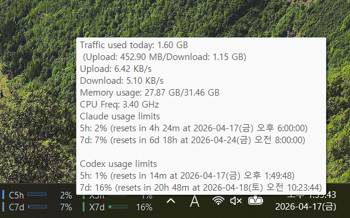

# TrafficMonitor AI Usage Limits


Taskbar usage limits for Claude and Codex through [TrafficMonitor](https://github.com/zhongyang219/TrafficMonitor) on Windows.
This repo ships a single `ClaudeUsagePlugin.dll`. Inside TrafficMonitor, the plugin appears as `AI Usage Limits`.

<p align="center">
  
</p>

I built this because checking the [Claude usage page](https://claude.ai/settings/usage) and the [Codex usage page](https://chatgpt.com/codex/cloud/settings/usage) in separate tabs was annoying. TrafficMonitor already had the right taskbar surface, so this plugin puts the current usage-limit windows there directly.

## Highlights

- Shows `C5h`, `C7d`, `X5h`, and `X7d` as used percentages directly in the Windows taskbar
- Displays reset timing in the tooltip when the source exposes it
- Uses a bundled Claude web helper for Claude values
- Reads Codex values from local Windows-readable state with `CODEX_HOME` support
- Does not keep stale Claude values forever; stale Claude data becomes unavailable

## Quick Start

1. Install TrafficMonitor first:
   - Download an official release from [TrafficMonitor Releases](https://github.com/zhongyang219/TrafficMonitor/releases)
   - Extract it anywhere you want, then run `TrafficMonitor.exe`
   - If you do not need temperature monitoring, the Lite package is usually enough
2. Match the plugin architecture to the installed TrafficMonitor build:
   - `x64` plugin for `x64` TrafficMonitor
   - `x86` plugin for `x86` TrafficMonitor
3. Copy the release contents into `TrafficMonitor\plugins`:

```text
plugins
├─ ClaudeUsagePlugin.dll
└─ ClaudeUsagePlugin
   ├─ claude-web-helper.ps1
   └─ helper
      └─ claude-web-helper
         ├─ index.mjs
         ├─ package.json
         └─ package-lock.json
```

4. Restart TrafficMonitor.
5. Open TrafficMonitor's taskbar window and enable `Claude 5h`, `Claude 7d`, `Codex 5h`, and `Codex 7d`.
6. Run the one-time Claude login if you want live Claude values:

```powershell
powershell -ExecutionPolicy Bypass -File .\plugins\ClaudeUsagePlugin\claude-web-helper.ps1 login
```

7. If Codex state is not stored in `%USERPROFILE%\.codex`, set `CODEX_HOME` in the Windows environment before launching TrafficMonitor.

If the helper files stay under `plugins\ClaudeUsagePlugin`, the bundled Claude watcher can auto-start on plugin load after that first login.

For the full screenshot walkthrough, see [docs/install.md](docs/install.md).

## What It Shows

- `C` = Claude, `X` = Codex
- `5h` = current 5-hour limit window
- `7d` = current 7-day limit window
- `C5h`, `C7d`, `X5h`, and `X7d` show used percentage
- Tooltips show the same used percentage plus reset timing when reset metadata is available
- If Codex local data reports remaining percentage, the plugin converts it before display

<p align="center">
  
</p>

## Data Sources

- Claude reads a fresh helper snapshot from `%LOCALAPPDATA%\trafficmonitor-claude-usage-plugin\claude-web-usage.json`
- Codex reads local state from `%USERPROFILE%\.codex\sessions\**\*.jsonl`
- Falls back to `%USERPROFILE%\.codex\logs_2.sqlite` when session JSONL data is unavailable
- Codex local payloads can expose either `used_percent` or `remaining_percent`; remaining values are converted to used percentage before display
- `CODEX_HOME` overrides the default Codex path when it resolves to a Windows-readable location
- TrafficMonitor runs on Windows, so Linux-only paths such as `/home/<user>/.codex` are not readable
- Claude helper usage requires Node.js 22+ plus a local Edge or Chrome install

For the full runtime model and helper commands, see [docs/runtime.md](docs/runtime.md).

## Compatibility

- Windows only
- TrafficMonitor plugin API v7
- TrafficMonitor itself is not bundled by this repo
- Official release assets are currently provided for `x64` and `x86`
- Internal deployment names stay `ClaudeUsagePlugin.dll` and `ClaudeUsagePlugin\...` for TrafficMonitor compatibility

If you do not need TrafficMonitor's temperature monitoring features, the official Lite release is usually enough.

## Build From Source

Requirements:

- Windows
- Visual Studio 2022 or Build Tools 2022
- Desktop development with C++
- MSVC `v143` toolset
- MFC for the `v143` toolset
- Windows SDK selected by Visual Studio

Build with Visual Studio or run:

```powershell
MSBuild.exe .\ClaudeUsagePlugin.sln /t:ClaudeUsagePlugin /p:Configuration=Release /p:Platform=x64
```

Primary build outputs:

- `build\x64\Release\plugins\ClaudeUsagePlugin.dll`
- `build\Release\plugins\ClaudeUsagePlugin.dll`

For the full output layout and packaging notes, see [docs/build.md](docs/build.md).

## Docs

- [Install guide](docs/install.md)
- [Runtime and helper guide](docs/runtime.md)
- [Build guide](docs/build.md)
- [Troubleshooting](docs/troubleshooting.md)
- [Changelog](CHANGELOG.md)
- [Release checklist](docs/release-checklist.md)
- [Release notes template](docs/release-notes-template.md)

## Common Issues

- Plugin loads but the usage items do not appear: usually architecture mismatch or the items are not enabled yet. See [docs/install.md](docs/install.md) and [docs/troubleshooting.md](docs/troubleshooting.md).
- Claude shows unavailable: usually the helper snapshot is missing, stale, or the Claude login expired. See [docs/runtime.md](docs/runtime.md) and [docs/troubleshooting.md](docs/troubleshooting.md).
- Codex values do not appear: check `CODEX_HOME`, Windows path visibility, and whether Codex has written recent local rate-limit data. See [docs/troubleshooting.md](docs/troubleshooting.md).
